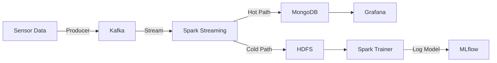

# Hydraulic System Anomaly Detection

> **Course**: Introduction to Big Data (IT4931)  
> **School**: Hanoi University of Science and Technology (HUST)  
> **Semester**: 2025.1


## Project Overview

This project implements a scalable, **End-to-End Big Data Pipeline** for monitoring and detecting anomalies in a hydraulic system. It leverages a modern Lambda Architecture to process real-time sensor data, detect faults instantly, and archive data for long-term machine learning analysis.

### Key Features
*   **Real-time Ingestion**: High-throughput data streaming with **Apache Kafka**.
*   **Steam Processing**: Low-latency ETL and feature extraction using **Spark Structured Streaming**.
*   **Data Lake**: Reliable long-term storage with **HDFS (Parquet format)**.
*   **Machine Learning**: Failure classification using **Spark MLlib** (Random Forest) tracked by **MLflow**.
*   **Monitoring**: Interactive dashboards with **Grafana** & **Prometheus**.
*   **Cloud Native**: Fully containerized and orchestrated on **Kubernetes (Kind)**.

---

## 👥 Team Members & Contributions

| Member | Student ID | Main Responsibility | Key Technical Contribution |
| :--- | :--- | :--- | :--- |
| **Pham Tran Tuan Khang** | 20225503 | Spark Streaming, Analytics, MongoDB | Window Aggregation, Watermarking logic, PromQL Dashboards. |
| **Quach Tuan Anh** | 20225469 | Data Ingestion, Kafka | Multi-threaded Producer, Drift Compensation Algorithm. |
| **Nguyen Tran Nghia** | 20225452 | HDFS, Data Lake | HDFS Architecture, Parquet Optimization, Repartitioning. |
| **Dinh Van Kien** | 20225505 | ML Pipeline, MLOps | Feature Engineering (Pivot), Random Forest, MLflow Registry. |
| **Pham Van Vu Hoan** | 20235497 | Kubernetes, Deployment | K8s StatefulSets, Dynamic Advertised Listeners, Infrastructure Code. |

---

## Architecture



---

## Getting Started

### Prerequisites
*   Docker Desktop & Kind
*   Kubectl
*   Python 3.10+

### 1️⃣ Quick Start (Single Script)
We provide a unified script to deploy the entire stack (K8s, HDFS, Kafka, App) in one go:

```bash
# Deploy entire infrastructure and application
./start-k8s.sh
./deploy-all.sh
```

### 2️⃣ Access Services
Once deployed, run the forwarding script to access UIs:

```bash
./forward_all.sh
```

| Service | URL | Credentials |
| :--- | :--- | :--- |
| **Grafana** | [http://localhost:3000](http://localhost:3000) | `admin` / `admin` |
| **MLflow** | [http://localhost:5050](http://localhost:5050) | - |
| **Spark UI** | [http://localhost:4040](http://localhost:4040) | - |
| **HDFS NameNode** | [http://localhost:9870](http://localhost:9870) | - |

### 3️⃣ Detailed Instructions
For a step-by-step guide on running the pipelines (Streaming & Training), please refer to:
👉 **[INSTRUCTION.md](INSTRUCTION.md)**

---

## 📂 Project Structure

```
├── k8s/                  # Kubernetes Manifests (HDFS, Kafka, Mongo...)
├── spark-apps/           # Spark Jobs (Processor & Trainer)
├── src/                  # Producer, Consumer, & Dashboard Scripts
├── reports/              # Final Project Report & Chapters
├── deploy-all.sh         # Main Deployment Script
└── INSTRUCTION.md        # User Guide
```

