# 🧠 Hydraulic System - Health & Anomalies Dashboard

## Executive Summary

This dashboard transforms raw sensor data into **actionable intelligence** using Apache Spark's distributed processing capabilities. It answers three critical questions:
1. **What is the current health state?** (Executive Summary)
2. **Where are the problems?** (Subsystem Anomaly Timelines)
3. **Why is it happening?** (Data Smoothing & Stability Analysis)

---

## 🏗️ The Big Data Architecture

```mermaid
graph LR
    A[17 Raw Topics] -->|Structured Streaming| B[Spark Cluster]
    B -->|Window Aggregation| C[Feature Engineering]
    C -->|Kafka Sink| D[hydraulic-analytics]
    D -->|Python Consumer| E[Anomaly Detection Logic]
    E -->|Prometheus| F[Metrics Export]
    F -->|Grafana| G[Dashboard]
```



**Key Architectural Decisions**:
1. **Why Spark?**: Handle 17 sensors × 100Hz = 1,700 data points/sec with sub-second latency
2. **Why Kafka as middleware?**: Decouples Spark (JVM) from Python consumers, enables replay for debugging
3. **Why Prometheus?**: Built for time-series data, integrates seamlessly with Grafana

---

## ⚡ Spark Streaming Job: Technical Deep Dive

### File: `spark-apps/spark_processor.py`

#### 1. Schema Definition & Kafka Source
```python
# CRITICAL DECISION: Define schema upfront for performance
schema = StructType([
    StructField("sensor", StringType()),
    StructField("cycle", IntegerType()),
    StructField("sample_idx", IntegerType()),
    StructField("value", DoubleType()),
    StructField("timestamp", StringType()),  # ISO8601 for human readability
    StructField("sampling_rate_hz", IntegerType())
])

df = spark.readStream \
    .format("kafka") \
    .option("kafka.bootstrap.servers", "kafka:29092") \
    .option("subscribePattern", "hydraulic-.*") \  # Wildcard for all 17 topics
    .option("startingOffsets", "latest") \
    .load()
```

**Why `subscribePattern`?**: Eliminates hardcoding all 17 topic names. New sensors auto-discovered.

**Why `startingOffsets: latest`?**: On restart, skip historical data (we care about *current* state, not replay).

---

#### 2. Watermarking for Late Data Handling
```python
watermarked = parsed.withWatermark("timestamp", "10 seconds")
```

**Problem Solved**: In distributed systems, messages arrive out-of-order due to network delays.

**Solution**: Watermark says "I'll wait up to 10 seconds for late data before finalizing a window."

**Tradeoff**:
- **10s**: Accommodates most network jitter without excessive delay
- Too small (e.g., 1s): Drop valid late data
- Too large (e.g., 60s): Delays in dashboard updates

---

#### 3. Sliding Window Aggregation (THE CORE INNOVATION)

```python
aggregated = watermarked \
    .groupBy(
        window(col("timestamp"), "1 minutes", "10 seconds"),
        col("sensor")
    ) \
    .agg(
        avg("value").alias("avg_value"),
        max("value").alias("max_value"),
        min("value").alias("min_value"),
        stddev_samp("value").alias("stddev_value"),
        count("value").alias("sample_count")
    )
```

**Mining Idea Origin**: Inspired by signal processing "envelope detection" - track the boundaries and center of a noisy signal.

**Window Parameters Deep Dive**:
- **Size = 1 minute**: Hydraulic systems have inertia. Meaningful state changes occur over 10-60 seconds, not milliseconds.
- **Slide = 10 seconds**: Updates every 10s provides near-real-time feedback without overwhelming analysts.

**Why These 5 Features?**:

| Feature | Mining Rationale | Anomaly Detection Use |
|---------|-----------------|----------------------|
| `avg_value` | **Baseline/Nominal State**. Removes high-frequency noise. | Detect gradual drift (sensor calibration, wear) |
| `max_value` | **Peak Detection**. Catches transient spikes that `avg` would smooth over. | Water hammer, pressure spikes (even if brief) |
| `min_value` | **Drop Detection**. Identifies sudden losses. | Cavitation, line rupture |
| `stddev_value` | **Stability/Variance**. Quantifies "jitter" in the signal. | Turbulent flow, mechanical looseness |
| `sample_count` | **Data Quality**. Verify we received expected samples (600 for 1min @ 100Hz). | Detect Kafka message loss |

**Alternative Considered & Rejected**: Median instead of Mean?
- **Pros**: More robust to outliers
- **Cons**: Requires sorting (expensive in Spark), and we *want* peaks to influence anomaly detection

---

#### 4. Derived Feature: Range
```python
(col("max_value") - col("min_value")).alias("range_value")
```

**Mining Idea**: Inspired by seismology (amplitude of earthquake waves). Quantifies the "violence" of fluctuations.

**Use Case**: Two sensors with same `avg` but different `range`:
- **Low Range**: Smooth operation
- **High Range**: Chaotic, unstable

---

#### 5. Output to Kafka
```python
output = aggregated.select(
    col("sensor").alias("key"),  # Partition by sensor for parallelism
    to_json(struct(...)).alias("value")
)

query = output.writeStream \
    .format("kafka") \
    .option("topic", "hydraulic-analytics") \
    .option("checkpointLocation", "/tmp/spark-checkpoints/analytics") \
    .outputMode("update") \  # Only emit changed windows
    .start()
```

**Why JSON serialization?**: Python consumer (next stage) easily deserializes without schema dependencies.

**Why `outputMode: update`?**: Reduces Kafka throughput - only send windows with new data.

---

## 🚨 Anomaly Detection: Consumer Logic

### File: `src/consumer_analytics.py`

#### Design Philosophy
**Spark's Job**: Calculate statistical features (what IS the data).
**Consumer's Job**: Apply domain knowledge (what does the data MEAN).

#### Anomaly Rules (Hard Thresholds)
```python
# Pressure sensors
if sensor.startswith("PS") and avg_value > 160:
    anomaly_type = "high_pressure"
    severity = -20  # Critical

if sensor.startswith("PS") and max_value > 180:
    anomaly_type = "pressure_spike"
    severity = -10  # Warning

# Temperature sensors  
if sensor.startswith("TS") and avg_value > 60:
    anomaly_type = "high_temperature"
    severity = -20  # Critical
```

**Why Hard Thresholds vs ML?**:
- **Pro**: Explainable to maintenance teams ("It exceeded 180 bar per specification")
- **Con**: Requires domain expertise to set thresholds
- **Alternative**: Z-score anomaly detection (generic but less interpretable)

#### Health Score Algorithm
```python
health_scores = {}
for sensor in SENSORS:
    health_scores[sensor] = 100  # Start perfect
    
    if has_anomaly(sensor):
        if anomaly_is_critical:
            health_scores[sensor] -= 20
        else:
            health_scores[sensor] -= 10
    
overall_health = average(health_scores.values())
```

**Design Rationale**:
- **Additive Penalties**: Multiple simultaneous issues compound (two -20 penalties → 60% health)
- **Per-Sensor Scores**: Identifies which subsystem is degrading
- **Overall Average**: Single number for executives ("How's the system?" → "78% healthy")

---

## 📉 Dashboard Panels: Chart-by-Chart Implementation

### Row 1: Executive Summary

#### ❤️ Overall System Health (Gauge)
**Query**: `avg(hydraulic_sensor_health_score) or vector(100)`

**Mining Idea**: Inspired by vehicle diagnostic "Check Engine" light. One glance = system status.

**Color Thresholds**:
```json
{
  "steps": [
    {"value": 0, "color": "red"},     // 0-80%: Immediate action
    {"value": 80, "color": "orange"}, // 80-90%: Schedule maintenance
    {"value": 90, "color": "green"}   // 90-100%: Healthy
  ]
}
```

**`or vector(100)` Explanation**: If Prometheus has no data (e.g., consumer just started), default to 100% instead of "No Data" error.

#### 🚨 Active Anomalies (Stat)
**Query**: `sum(hydraulic_anomaly_status) or vector(0)`

**Implementation Choice**: `sum()` aggregates across all sensors. A value of "5" means 5 sensors currently flagged.

**Visualization Trick**: `decimals: 0` forces integer display (no "2.4 anomalies").

#### 📈 Anomaly Trend (TimeSeries)
**Query**: `sum(hydraulic_anomaly_status)`

**Mining Goal**: Detect **temporal patterns**:
- Anomalies every 10 minutes → Cyclic load
- Anomalies clustering at 8 AM → Startup transient
- Gradual increase over days → Progressive failure

#### 📊 Hourly Total (Stat)
**Query**: `sum(increase(hydraulic_anomaly_total[1h]))`

**Difference from "Active"**: 
- **Active**: Current count (can go down when issues resolve)
- **Hourly Total**: Cumulative (monotonically increasing counter)

---

### Row 2: Signal Analysis

#### 🌊 Data Smoothing Effect (THE KILLER FEATURE)
**Queries**:
```json
[
  {"expr": 'hydraulic_raw_ps1', "legendFormat": "Raw Signal (Noisy)"},
  {"expr": 'hydraulic_sensor_avg_1m{sensor="PS1"}', "legendFormat": "Spark 1m Avg"}
]
```

**Mining Idea**: **Before/After comparison** - visually prove Spark's value proposition.

**Visual Design**:
```json
"overrides": [
  {
    "matcher": {"id": "byName", "options": "Raw Signal (Noisy)"},
    "properties": [
      {"id": "custom.lineWidth", "value": 1},
      {"id": "custom.lineStyle", "value": "dash"},  // Thin dashed grey
      {"id": "color", "value": {"fixedColor": "rgba(100,100,100,0.5)"}}
    ]
  },
  {
    "matcher": {"id": "byName", "options": "Spark 1m Avg (Smooth)"},
    "properties": [
      {"id": "custom.lineWidth", "value": 4},  // Thick solid yellow
      {"id": "color", "value": {"fixedColor": "#FFFF00"}}
    ]
  }
]
```

**Why This Matters**: Makes the abstract concept of "signal processing" tangible. Yellow line clearly cuts through grey noise.

---

### Row 3: Pressure Subsystem

#### Anomaly Timeline (State Timeline)
**Query**: `hydraulic_anomaly_status{sensor=~"PS.*", type=~"high_pressure|pressure_spike"}`

**Why State Timeline?**: Time-series shows values. State timeline shows **state changes** (green→red transitions).

**Filter Logic**:
- `sensor=~"PS.*"`: Regex for Pressure Sensors only
- `type=~"high_pressure|pressure_spike"`: Exclude irrelevant anomaly types

**Interpretation**: Long red bar = sustained issue. Brief red spike = transient event.

#### Stability Matrix (StdDev Chart)
**Query**: `hydraulic_sensor_stddev_1m{sensor=~"PS.*"}`

**Mining Idea**: Turbulent flow has high standard deviation. Track stability over time.

**Correlation with Anomalies**: If stddev spikes *before* pressure anomaly → early warning system.

---

### Row 4: Temperature Subsystem

**Implementation**: Similar to Pressure, but filtered for `sensor=~"TS.*"` and `type="high_temperature"`.

**Design Duplication Rationale**: Operators are subsystem-specialists. Having separate, focused views reduces cognitive load.

---

### Row 5: Statistical Insights

#### Gauge Panel (System Vitals)
**Queries**: Multiple instantaneous values (PS1, TS1, EPS1).

**Layout Choice**: Radial gauges create visual "tension" when needles approach red zones. More attention-grabbing than numbers.

#### Pie Chart (Anomaly Distribution)
**Mining Idea**: Track the **composition** of failures:
- 80% pressure issues → Investigate pump
- 80% temperature issues → Investigate cooler

#### Bar Gauge (Top Offenders)
**Query**: `topk(5, hydraulic_anomaly_total)`

**Mining Idea**: Pareto principle - 80% of downtime from 20% of sensors. Target these for replacement.

#### Heatmap (Pressure Intensity)
**Mining Idea**: Frequency distribution. Identify the "normal operating band" vs outliers.

---

##  🎯 Real-World Usage Scenarios

### Scenario 1: Pump Cavitation Detection
**Symptoms**:
1. **Data Smoothing Chart**: Raw signal shows erratic spikes
2. **Stability Matrix**: PS1 stddev jumps to 5 bar (normally <1 bar)
3. **Anomaly Timeline**: Intermittent red bars for "unstable"

**Root Cause**: Insufficient inlet pressure → air bubbles → cavitation → pump damage

**Action**: Increase inlet pressure or reduce flow demand.

---

### Scenario 2: Progressive Cooler Fouling
**Symptoms**:
1. **Health Score**: Slowly declining from 95% to 85% over 2 weeks
2. **Temperature Timeline**: TS2 (cooler outlet) showing more frequent red bars
3. **Hourly Total**: Anomaly count increasing trend

**Root Cause**: Heat exchanger fouling reducing cooling efficiency.

**Action**: Schedule cooler cleaning during next maintenance window.

---

## 🔧 Maintenance & Tuning Guide

### Adjusting Spark Window Size
**Current**: 1 minute window, 10s slide

**If system is slower (e.g., large tank with high inertia)**:
```python
window(col("timestamp"), "5 minutes", "30 seconds")
```

**If system is faster (e.g., servo hydraulics)**:
```python
window(col("timestamp"), "10 seconds", "2 seconds")
```

### Threshold Tuning
Edit `consumer_analytics.py`:
```python
# Example: Lower pressure threshold for more sensitive detection
if sensor.startswith("PS") and avg_value > 150:  # Was 160
    anomaly_type = "high_pressure"
```

**Tuning Process**:
1. Analyze false positive rate over 1 week
2. Adjust threshold up/down by 5% increments
3. Re-evaluate
